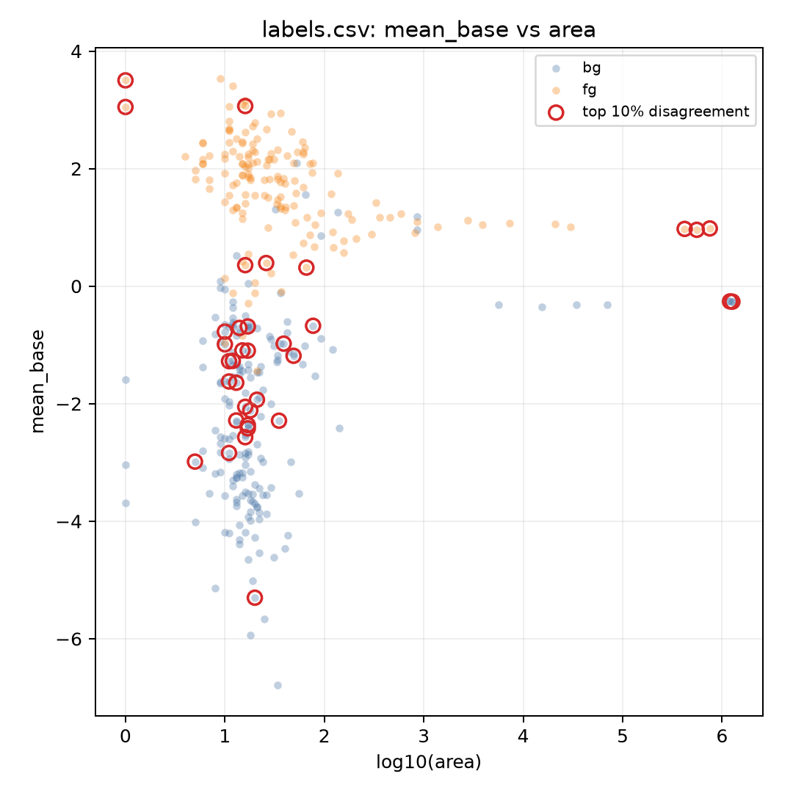
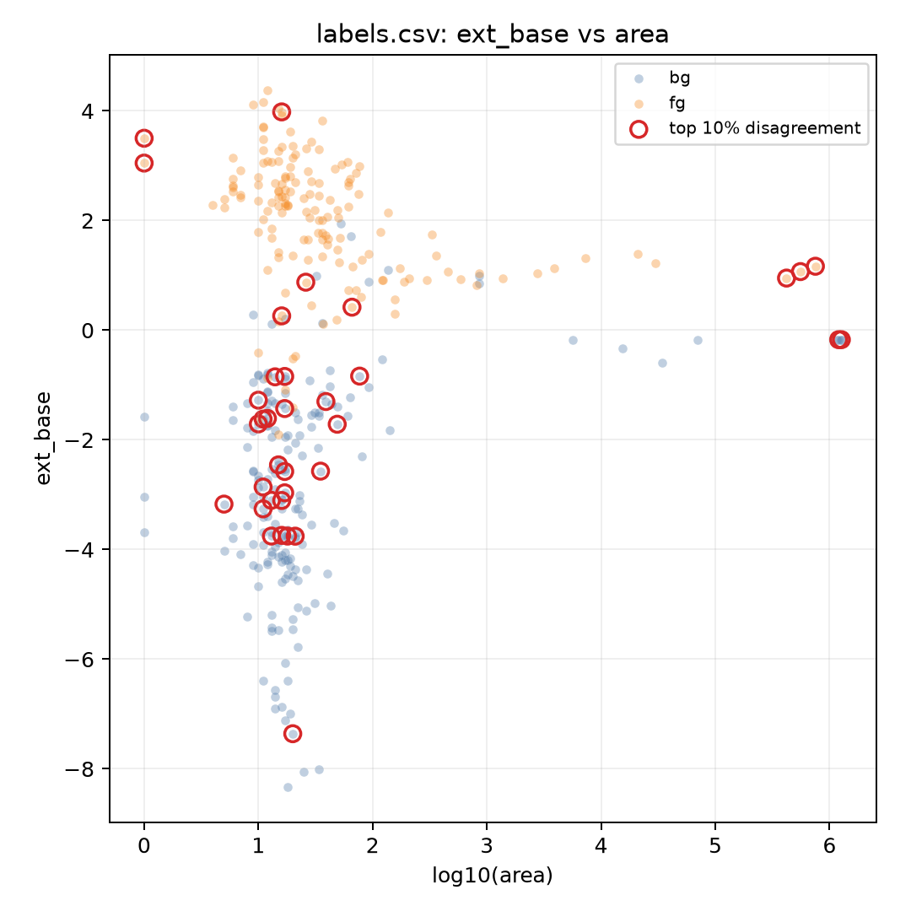
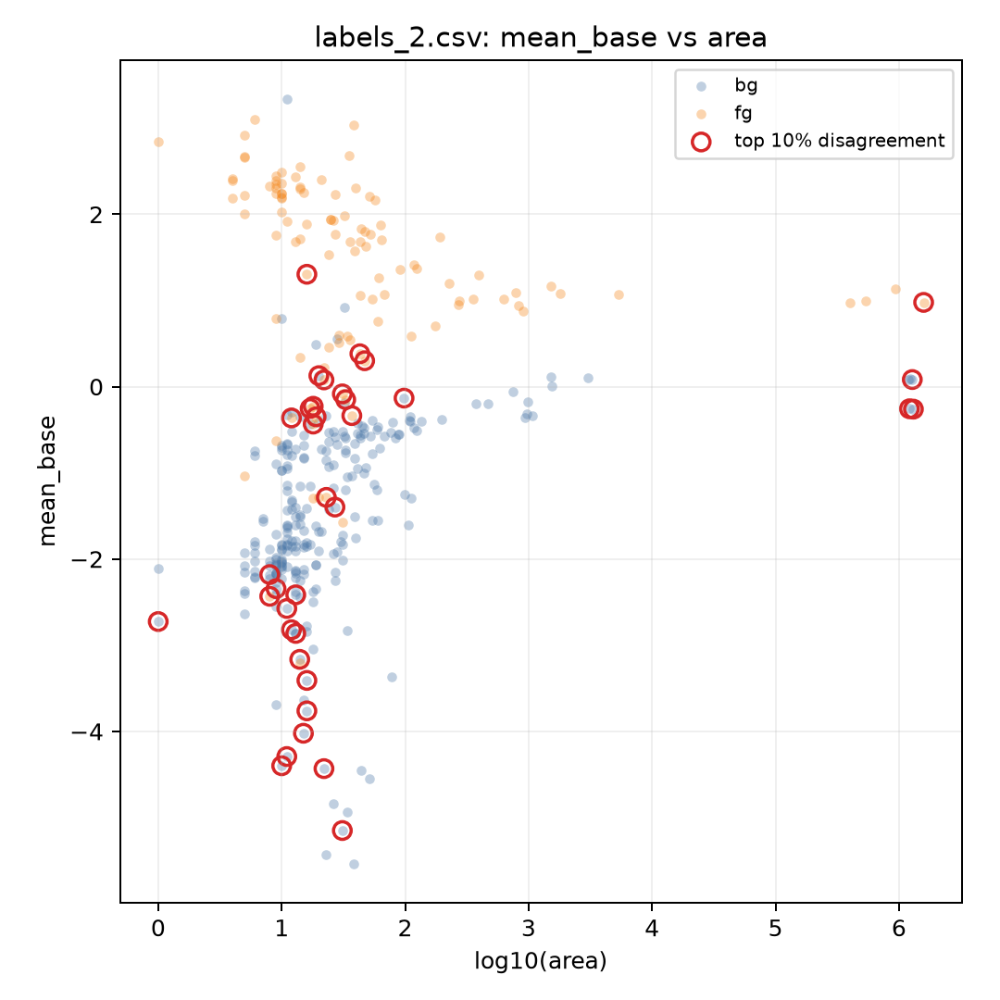
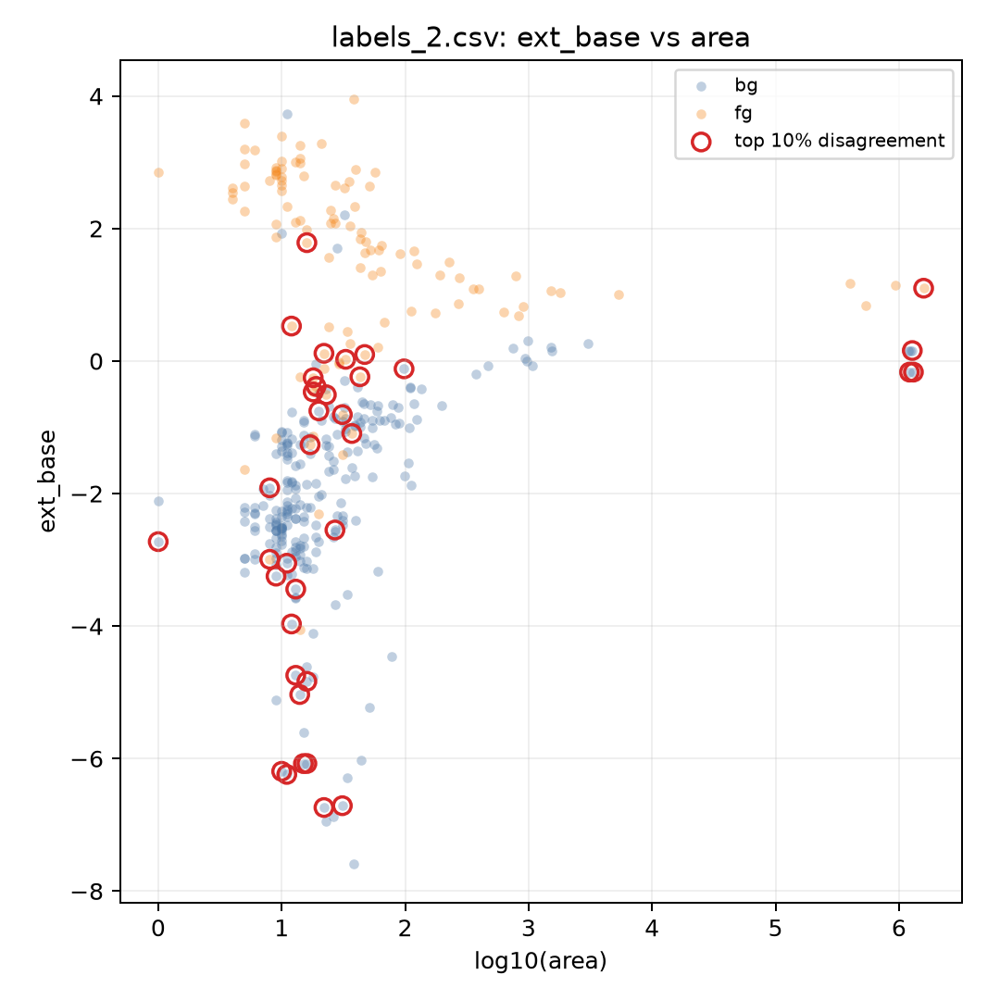
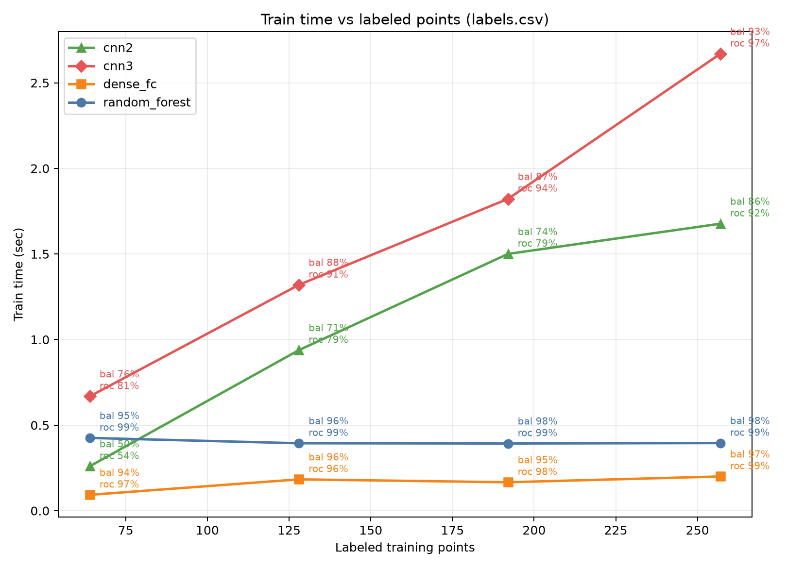
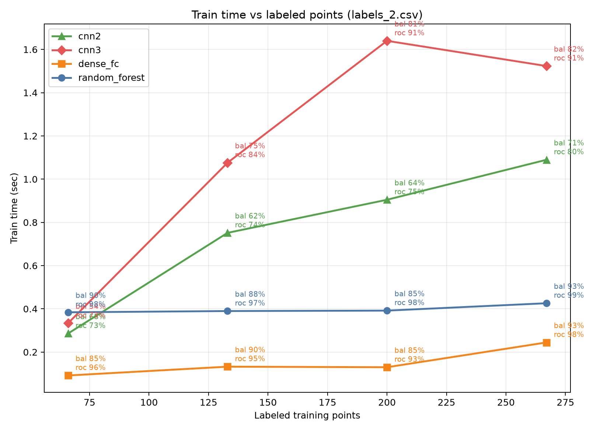

# Initial Findings: Spears Label Classifiers

## Inputs

The supervised classification target is class `1` vs class `2`; class `0` is treated as unlabeled and excluded from training/evaluation. `slice`, `region_id`, bbox/position columns, and `predicted` when present are metadata, not model dimensions.

| Input | Rows | Columns | Unlabeled | BG | FG | Features without area | Features with area | Notes |
|---|---:|---:|---:|---:|---:|---:|---:|---|
| labels.csv | 14336 | 64 | 13993 | 188 | 155 | 54 | 55 | class 0 excluded |
| labels_2.csv | 33833 | 65 | 33477 | 246 | 110 | 54 | 55 | class 0 excluded; predicted ignored |

## Model Performance With and Without Area

All results are 5-fold stratified cross-validation. Neural models report out-of-fold probabilities from PyTorch models with weighted cross entropy and internal validation early stopping. Random forest uses balanced class weights.

| Dataset | Area | Model | Balanced acc | ROC AUC | FG precision | FG recall | Errors |
|---|---:|---|---:|---:|---:|---:|---:|
| labels.csv | no | random_forest | 95.1% | 99.2% | 93.8% | 95.5% | 17 |
| labels.csv | no | dense_fc | 94.2% | 97.8% | 93.0% | 94.2% | 20 |
| labels.csv | no | cnn3 | 93.7% | 96.7% | 91.4% | 94.8% | 22 |
| labels.csv | no | cnn2 | 92.8% | 95.1% | 90.9% | 93.5% | 25 |
| labels.csv | yes | random_forest | 95.1% | 99.2% | 93.8% | 95.5% | 17 |
| labels.csv | yes | cnn3 | 93.6% | 96.8% | 92.0% | 94.2% | 22 |
| labels.csv | yes | dense_fc | 93.2% | 97.6% | 89.9% | 95.5% | 24 |
| labels.csv | yes | cnn2 | 87.1% | 93.6% | 83.3% | 89.7% | 45 |
| labels_2.csv | no | dense_fc | 96.1% | 98.3% | 92.3% | 96.4% | 14 |
| labels_2.csv | no | random_forest | 94.0% | 99.1% | 93.5% | 90.9% | 17 |
| labels_2.csv | no | cnn3 | 88.1% | 92.6% | 87.7% | 81.8% | 34 |
| labels_2.csv | no | cnn2 | 80.4% | 86.0% | 67.0% | 80.0% | 69 |
| labels_2.csv | yes | dense_fc | 96.3% | 98.8% | 93.0% | 96.4% | 13 |
| labels_2.csv | yes | random_forest | 93.8% | 99.1% | 94.2% | 90.0% | 17 |
| labels_2.csv | yes | cnn3 | 90.0% | 94.1% | 89.9% | 84.5% | 28 |
| labels_2.csv | yes | cnn2 | 78.4% | 83.8% | 60.8% | 80.0% | 79 |

### Area Effect

- `labels.csv`: largest area effect was `cnn2` (-5.6 balanced-accuracy points).
- `labels_2.csv`: largest area effect was `cnn2` (-2.0 balanced-accuracy points).

Random forest feature importance assigns very little direct weight to `area`: `0.16%` for `labels.csv` and `0.22%` for `labels_2.csv` in the with-area runs. Area still changed some neural outcomes, so it may be acting as a weak regularizing/context dimension rather than a primary separator.

## Hard-To-Explain Set

The hard-to-explain set is defined as the top 10% of labeled regions by cross-model `prob_fg` disagreement in the with-area run.

- `labels.csv`: top-disagreement threshold = 0.463; n = 35.
- `labels_2.csv`: top-disagreement threshold = 0.619; n = 36.

| Dataset | Set | n | BG | FG | Median area | Median mean_base | Median ext_base | Median min_base | Median max_base |
|---|---|---:|---:|---:|---:|---:|---:|---:|---:|
| labels.csv | all labeled | 343 | 188 | 155 | 18 | -0.316 | -0.784 | -1.564 | 0.636 |
| labels.csv | top 10% disagreement | 35 | 26 | 9 | 17 | -1.094 | -1.608 | -2.670 | -0.003 |
| labels_2.csv | all labeled | 356 | 246 | 110 | 18 | -0.741 | -1.169 | -1.689 | 0.451 |
| labels_2.csv | top 10% disagreement | 36 | 21 | 15 | 18 | -0.860 | -1.178 | -2.670 | 0.196 |

Class-specific view:

| Dataset | Class | Set | n | Median area | Median mean_base | Median ext_base | Median min_base | Median max_base |
|---|---|---|---:|---:|---:|---:|---:|---:|
| labels.csv | bg | all labeled | 188 | 17 | -1.982 | -2.792 | -3.092 | -0.621 |
| labels.csv | bg | top 10% disagreement | 26 | 16 | -1.449 | -2.513 | -2.765 | -0.492 |
| labels.csv | fg | all labeled | 155 | 25 | 1.809 | 2.193 | 0.336 | 2.582 |
| labels.csv | fg | top 10% disagreement | 9 | 26 | 0.974 | 1.069 | -2.368 | 3.296 |
| labels_2.csv | bg | all labeled | 246 | 15 | -1.560 | -2.034 | -2.375 | -0.069 |
| labels_2.csv | bg | top 10% disagreement | 21 | 15 | -2.725 | -3.442 | -3.796 | -1.430 |
| labels_2.csv | fg | all labeled | 110 | 26 | 1.551 | 1.669 | -0.156 | 2.551 |
| labels_2.csv | fg | top 10% disagreement | 15 | 22 | -0.228 | -0.252 | -1.600 | 0.790 |

Interpretation: the disagreement set is not explained cleanly by `area` alone. Median areas are close to the full labeled populations, and the random forest gives area almost no importance. The stronger pattern is in `base_` intensity. In `labels.csv`, hard bg rows are brighter than typical bg and hard fg rows are less bright than typical fg, so both move toward the class boundary in base-intensity space. In `labels_2.csv`, hard fg rows are strongly bg-like by `mean_base`/`ext_base`, while hard bg rows are even darker than the full bg set, suggesting extreme-background or boundary cases. That points to ambiguous/transitional material or label-boundary issues more than to a missing deep-CNN architecture.

## Four Square Plots

Each plot is square. Filled points are all labeled rows; red outlines mark the top 10% disagreement rows.

## Train Time vs Point Count

Sparse sweep at 1/4, 2/4, 3/4, and full of a stratified train pool (25% held out fixed for scoring). Each fraction is averaged over 2 random stratified draws. Curve points are labeled with balanced accuracy and ROC AUC on the held-out test set. Area is included.

### Average classify time (µs / point)

| Dataset | dense_fc | cnn2 | cnn3 | random_forest |
|---|---:|---:|---:|---:|
| labels.csv | 0.95 | 8.3 | 18.9 | 596 |
| labels_2.csv | 0.79 | 7.3 | 17.7 | 539 |

Dense FC is both fast to train and by far the cheapest to classify. Random forest train time is nearly flat in this size range (~0.4 s) but classify is ~500–600 µs/point. CNN train time grows with sample count; cnn2 remains weak on quality even as train time rises.

Raw tables: `scratch/train_time_vs_points_labels.csv`, `scratch/train_time_vs_points_labels_2.csv`, and matching `*_classify.csv` / `.json`.

## Files

- Run outputs: `scratch/runs/`
- Probability CSVs: `scratch/runs/*_predictions.csv`
- Hard-example CSVs: `scratch/runs/*_hard_examples.csv`
- Train-time sweep: `scratch/train_time_vs_points*.{csv,json,png}`
- Plot images: `scratch/plots/`
